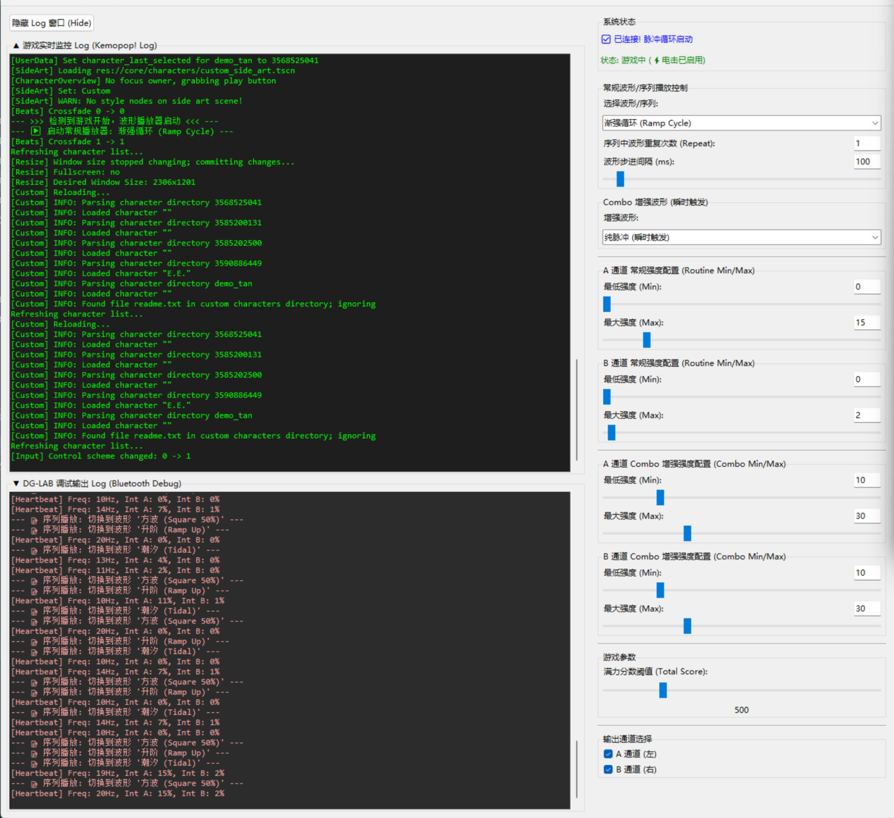

# 🐺 DGLab Kemopop! Controller ⚡

## 🎮 将你的 Kemopop! 连接到你的 DGLAB郊狼3设备上
### [更新将跟随 Steam游戏版本 进行更新 | 当前最高支持版本：2.1.5.0](https://store.steampowered.com/app/1332010)



本来是为了个人用途而为 **Kemopop!** 游戏设计的实时联动控制器
它通过监控游戏进程的输出 Log，自动解析游戏事件（如 Combo 触发、游戏开始/结束）
并将这些事件实时转换为波形指令，通过 **蓝牙 (BLE)** 协议发送给 **DG-LAB V3 (Coyote)** 脉冲设备

---

## 🚀 特性

* **实时游戏事件监控：** 自动启动并监控 `kemopop.exe` 进程的输出日志，快速捕捉游戏开始、结算、以及最重要的 `[Chain] TOTAL SCORE` COMBO分数
* **独立波形播放器：** 独立于游戏 Log 解析线程运行，提供流畅的常规波形（Routine）和瞬时增强波形（Combo）播放
* **性能：** 内置 Log 窗口开关，当隐藏 Log 窗口时，程序会**停止所有LOG相关 UI 写入操作**，确保后台游戏逻辑解析和蓝牙发送线程的极高性能和低延迟
* **强度映射：** 为**常规波形**和**Combo 增强**分别设置独立的 `Min/Max` 强度限制，并根据游戏分数（`TOTAL SCORE`）动态调整 Combo 脉冲强度
* **分通道控制：** 可独立启用或禁用 A/B 通道，实现单通道或双通道输出

---

## 🛠️ 安装与运行

### 1. 环境要求

* **操作系统:** Windows (需要支持 BLE 蓝牙 4.0 及以上)
* **Python:** 3.8 或更高版本
* **依赖库:** `tkinter`, `bleak`, `asyncio`, `re`, `subprocess`, `bleak`

### 2. 依赖安装 (必须的)

```bash
pip install bleak

```

### 3. 文件准备

把这个py文件或者可执行文件丢到你的kemopop根目录下（steamapps\common\Kemopop!\...）：

**游戏主程序:** `kemopop.exe` (它默认启动地址是 "./kemopop.exe")

### 4. 运行程序

```bash
python DGLab_Kemopop.py

```

---

## 📝 CR

### DGLabV3Controller (蓝牙核心类)

* 使用 `bleak` 库在独立线程中进行异步蓝牙连接和操作
* 核心指令是 **`B0` (心跳/脉冲指令)**，每 100ms 广播一次
* `BF` 指令用于在连接时设置 DG-LAB V3 的软上限为 100% (`0x64`)

### GameControllerApp (UI/逻辑核心类)

* **性能优化 (`consume_logs` & `_write_log`):**
* 游戏 Log 仍然通过 `subprocess.Popen` 持续读取，并放入 `self.log_queue`。
* `consume_logs` 函数**始终**运行 `self._parse_logic(line)` 进行游戏事件判断
* `_write_log` 在 `self.var_log_visible` 为 `False` 时会立即返回，**跳过**所有 Tkinter UI 写入和 `after` 调度


* **波形计算 (`_next_pattern_step` & `_play_combo_step`):**
* `final_intensity = min + (wave_int_raw / 100) * (max - min)`：这是将原始波形步进值 (`wave_int_raw`) 映射到用户自定义 `[Min, Max]` 范围的核心公式
* Combo 步进在此基础上引入 `score_multiplier` 进行二次强度缩放

---

## 📜 感谢：
> 1️⃣ 核心脉冲控制逻辑：[DG-LAB OPENSOURCE V3 蓝牙协议](https://github.com/amoeet/VRChat_X_DGLAB)
>
> 2️⃣ 更多波形支持： [DG-LAB v2 PulseData](https://github.com/BobH233/DGLab-v2-PulseData)
>
> 本项目为个人用途而编写，基于开源协议，请自行参考。
